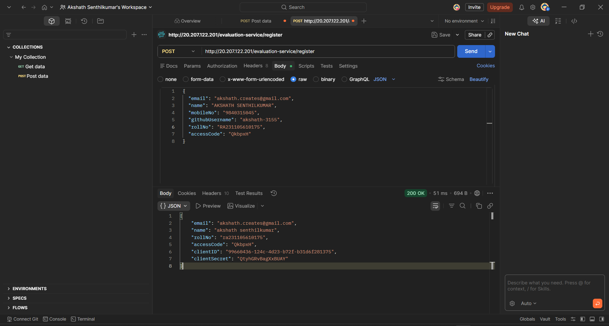
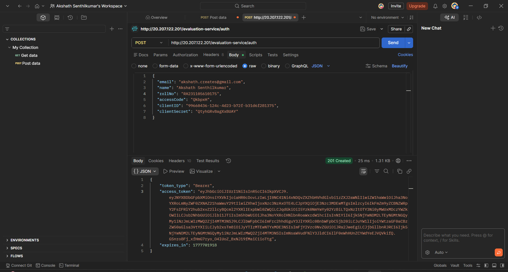
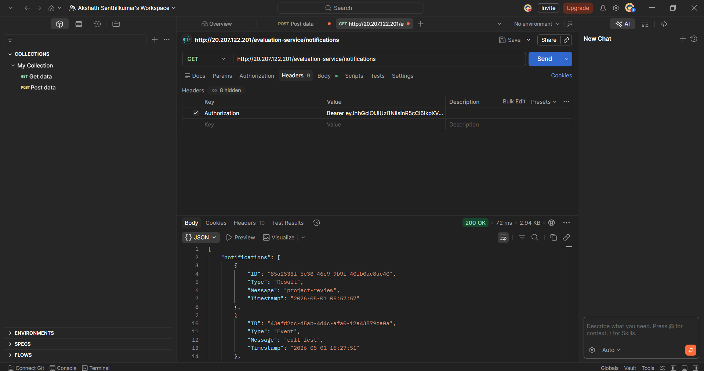
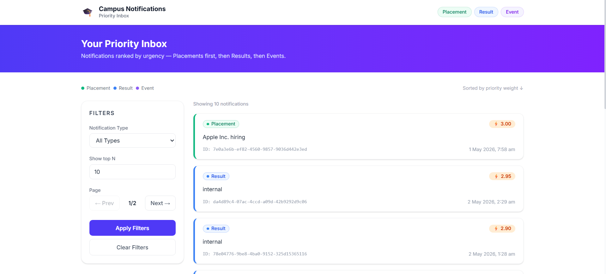

# RA2311056010175 (Frontend)

A clean and concise React-based Notification System built with Vite and TypeScript. It securely fetches, prioritizes, and displays real-time notifications with filtering and pagination capabilities.

## Screenshots

### API (Postman)
**1. Register**  


**2. Auth (Access Token)**  


**3. Notifications**  


### Frontend (UI)
**UI, Filter, and Pagination**  


## Features

- Fetch notifications using Bearer token
- Display notifications
- Unread first sorting
- Filter by type
- Pagination
- Logging middleware

## Tech Stack

- React (Vite + TypeScript)
- Fetch API

## Project Structure

```text
├── Screenshots/          # Project screenshots
├── src/
│   ├── components/       # Reusable UI components (NotificationCard, PriorityInbox, etc.)
│   ├── services/         # API integration, Token management, and Logger
│   ├── types/            # TypeScript interfaces
│   ├── App.tsx           # Main application entry point
│   └── main.tsx          # React DOM rendering
├── .env                  # Environment variables (not tracked in git)
├── index.html            # Vite HTML entry point
├── package.json          # Dependencies and scripts
└── vite.config.ts        # Vite configuration
```

## Setup Instructions

1. **Clone the repo**
   ```bash
   git clone <repository-url>
   ```
2. **Install dependencies**
   ```bash
   npm install
   ```
3. **Create a `.env` file** in the root directory.
4. **Add `VITE_API_TOKEN` and API configurations** to the `.env` file:
   ```env
   VITE_API_BASE_URL=/api
   VITE_CLIENT_ID=<your-client-id>
   VITE_CLIENT_SECRET=<your-client-secret>
   VITE_ACCESS_TOKEN=<your-token-here>
   ```
5. **Start the development server**
   ```bash
   npm run dev
   ```

## API Usage

- **Endpoint:** `http://20.207.122.201/evaluation-service/notifications`
- **Method:** `GET`
- **Authorization:** `Bearer <token>`

## Notes

- Token not hardcoded for security
- Must be added via `.env`
